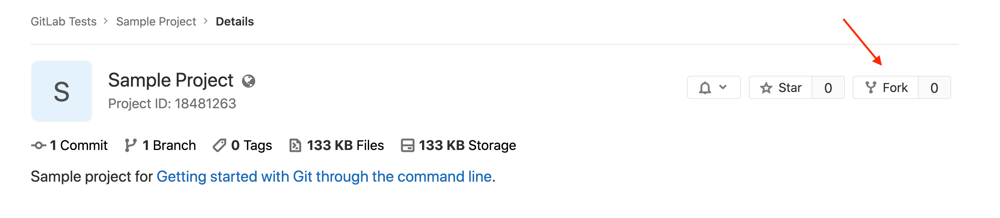

# Sample Project

Sample project for [Getting started with Git through the command line](https://docs.gitlab.com/ee/gitlab-basics/start-using-git.html).

## Steps

1. Fork this project into your username. To do so, click **Fork** form this
   project's [home page](https://gitlab.com/gitlab-tests/sample-project/):

   
   
1. Choose the namespace you want it forked into. If you don't have any groups
   in your account, when you click **Fork** GitLab won't ask you where you'd
   like to fork it into.